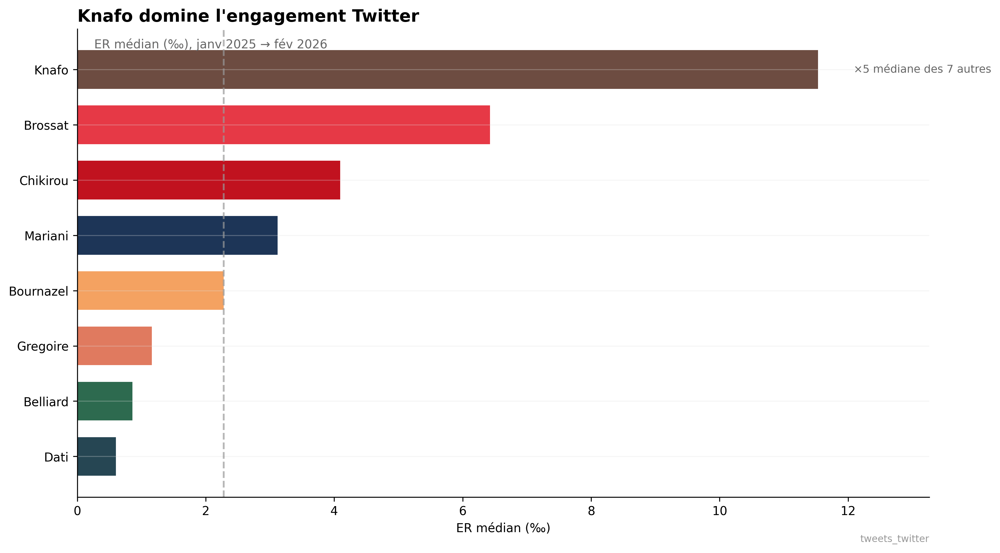

# 🗳️ Paris 2026 — Qui domine la conversation numérique ?

> Analyse quantitative de 7 659 tweets, 44 599 réponses et 3 317 posts Instagram
> de 8 candidats aux municipales de Paris. 13 mois. NLP. Réseaux. OSINT.



---

## 3 résultats clés

1. **Knafo domine l'engagement** — ER médian 11,5 ‰ (×5 la médiane des 7 autres). Distribution très asymétrique : quelques pics viraux expliquent l’écart.
2. **Grégoire = hub des mentions** — 80 des 139 mentions cross-candidats (57 %). Quand les candidats s’attaquent, ils parlent de lui.
3. **Echo chambers marqués** — Knafo 88 %, Chikirou 78 %, Dati 77 %. Homophilie idéologique : corrélation ρ ≈ −0,60 entre proximité idéologique et chevauchement d’audience.

---

## Liens

| Ressource | Contenu |
|-----------|---------|
| [Méthodologie](docs/methodologie.md) | ER, NSI, echo score, LDA, limites |
| [Résultats chiffrés](docs/RESULTATS_CHIFFRES.md) | Tableaux exhaustifs, p-values |
| [Notebooks](notebooks/) | 9 notebooks d’analyse (engagement → BERT) |
| [Note d'analyse](docs/note_analyse.md) | Synthèse narrative, findings |
| [Références](docs/REFERENCES.md) | Bibliographie académique |
| [Article Substack](docs/SUBSTACK_ARTICLE_1.md) | « Qui domine Twitter aux municipales 2026 ? » |

---

## Reproduction

```bash
pip install -r requirements.txt
# Placer tweets_twitter.csv, posts_instagram.csv, replies_classified.csv dans final/data/
jupyter notebook notebooks/01_engagement_viralite.ipynb
```

---

## À propos

Projet personnel — analyse OSINT et data science des campagnes numériques municipales.  
**Sami Nakib** · [GitHub](https://github.com/SamiNakibETU)

---

*Licence MIT*
