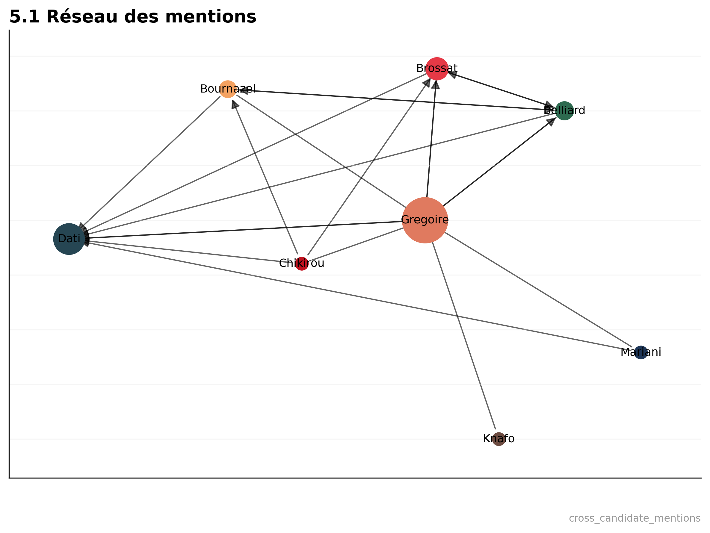
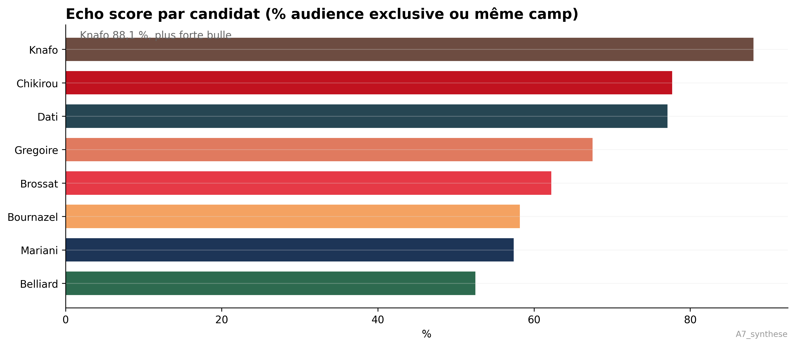

# Municipales Paris 2026 : qui domine la conversation numérique ?

*Article prêt à publier sur Substack. Figures dans `figures/`.*

---

## Hook

7 659 tweets, 8 candidats, 13 mois de campagne. Qui a le plus d'impact sur Twitter aux municipales de Paris 2026 ? Les données donnent une réponse surprenante : ce n'est pas celui qu'on croit.

---

## Le classement : l'engagement en ‰

Sarah Knafo (Reconquête) domine avec un engagement rate (ER) de **11,5‰** — soit environ **5 fois la médiane** des sept autres candidats. Son audience dépasse le cadre parisien : députée européenne, elle mobilise une base nationale sur les sujets de campagne.

Les autres se répartissent en deux groupes : Brossat, Chikirou et Mariani (ER médian 3–6‰) représentent la gauche radicale et l'extrême droite, plus engagées numériquement. Dati et Belliard, en dessous de 1‰, illustrent la difficulté de la droite modérée et de l'écologie à capter l'attention sur la plateforme.

---

## Le paradoxe Grégoire

Emmanuel Grégoire (PS, candidat sortant) est le **hub du débat** : il reçoit **57 % des mentions** cross-candidats. Quand un adversaire parle d'un concurrent, c'est souvent de lui qu'il s'agit.

Pourtant, son ER le place au **6ᵉ rang sur 8**. Invisible en engagement, central dans la conversation : Grégoire structure le débat sans en capter la viralité. Les autres candidats se définissent volontiers *contre* lui, mais les comptes qui le critiquent ou le défendent n'alimentent pas sa propre audience.

---

## Les bulles : qui parle à qui ?

Knafo atteint **88 % d'echo score** : les comptes qui lui répondent interagissent presque exclusivement avec son camp ou sa famille politique. Dati et Chikirou suivent (77 %). Les audiences forment des silos.

Les candidats les plus centraux (Grégoire, Brossat) voient davantage de croisement entre leurs répondeurs. Ce sont les hubs, mais les bulles restent la règle : moins deux candidats sont proches idéologiquement, plus leurs audiences se chevauchent (ρ = −0,60).

---

## Limites

Les données proviennent de Nitter (Twitter) et du scraping Instagram. Biais possibles : sous-représentation des comptes privés, Knafo en outlier statistique. Une analyse contrefactuelle sans Knafo confirme que les conclusions (polarisation, bulles) tiennent pour les sept autres candidats. Pas de causalité démontrée : corrélation uniquement.

---

## Conclusion

La polarisation est le moteur de l'engagement, pas la qualité programmatique. Les candidats qui structurent le débat (Grégoire) ne sont pas ceux qui dominent l'attention (Knafo). Les audiences se parlent peu entre elles. Une leçon pour 2026 — et au-delà.

---

*Code et données sur [GitHub](https://github.com/SamiNakibETU/Trend_Analysis_candidates_Paris).*
